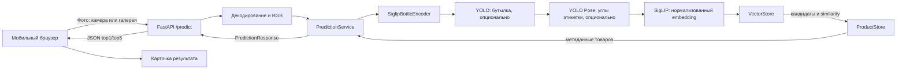

# Архитектура Vino Scan

Документ описывает текущую реализацию сервиса распознавания вина. Backend выполняет inference по готовым весам: обучение моделей в runtime не происходит.

## Общий поток

Если детектор бутылки не находит бутылку или его веса отсутствуют, обработка продолжается на исходном фото. Если этикетка не найдена, поиск выполняется по кропу бутылки; если кропа нет — по исходному фото.

## Этапы обработки фотографии

### 1. Захват и нормализация

Frontend (`web/src/camera.ts`, `web/src/App.tsx`) получает кадр с основной камеры или файл из галереи. Кадр камеры уменьшается до ширины не более 1280 пикселей и кодируется в JPEG с качеством 0,78. Выбранное из галереи фото передаётся как есть.

Backend (`app/main.py`) принимает multipart-поле `file`, ограничивает загрузку 15 МБ, декодирует изображение через Pillow и приводит его к RGB. Подготовку размера и тензоров под SigLIP выполняет processor из Transformers внутри encoder. Отдельной общей нормализации EXIF-ориентации в API нет.

Граница слоя: браузер отвечает за получение и предварительное сжатие снимка камеры; API — за ограничение размера, декодирование и базовое представление изображения.

### 2. Поиск бутылки и этикетки

`app/inference.py` содержит `SiglipBottleEncoder`; в нём выполняются оба детектора и извлечение признаков.

1. YOLO `detect` выбирает рамку бутылки с наибольшей уверенностью. По ней строится кроп. Если детектор не настроен или бутылка не найдена, используется исходное изображение.
2. При наличии кропа бутылки YOLO `pose` ищет keypoints этикетки. Четыре точки упорядочиваются как углы, после чего `cv2.warpPerspective` выравнивает этикетку в изображение 400 × 600. Если этикетка не найдена, используется кроп бутылки.
3. В выбранный источник изображения подаются processor и дообученный checkpoint SigLIP. Модель возвращает image features; encoder нормализует итоговый вектор по L2 и сообщает режим `label` или `full`, а также флаги `bottle_found` и `label_found`.

Если YOLO-веса отсутствуют, соответствующий этап пропускается. Веса бутылки должны быть YOLO `detect`, веса этикетки — YOLO `pose`.

### 3. Поиск по каталогу

`app/retrieval.py` отвечает только за сравнение embedding запроса с эталонами и возвращает названия классов с оценками сходства, а если источник содержит ключ товара — также его идентификатор. Это поиск ближайших векторов, а не классификатор по фиксированным классам.

- `VECTOR_BACKEND=csv` (значение по умолчанию): `CsvVectorStore` загружает эталонные векторы в память при первом запросе, нормализует их и считает cosine similarity. Для каждого `product_id` (если он задан) или названия оставляется максимальная оценка; возвращаются первые `TOP_K` результатов, максимум 5.
- `VECTOR_BACKEND=pgvector`: `PgVectorStore` ищет в `product_embeddings` с помощью cosine distance и сохраняет `products.id` найденной записи. Для режима `label` используется `image_type=crop`, для `full` — `image_type=full`; версия модели по умолчанию — `finetuned`.

В CSV-режиме используются колонки `embedding_label_finetuned` и `embedding_full_finetuned` из `data/reference/embedding_comparison_reference.csv`. Векторы исходного и дообученного SigLIP также используются импортёром для PostgreSQL.

Граница слоя: VectorStore знает о векторах, режиме, версии модели и метрике поиска, но не формирует карточки товаров.

### 4. Обогащение результата и карточка

`PredictionService` (`app/service.py`) передаёт идентификатор товара из pgvector напрямую в `ProductStore` (`app/products.py`), который получает карточку по `products.id`. Это сохраняет связь с конкретным товаром, даже если несколько карточек имеют одинаковое отображаемое название. Для старых CSV-эталонов без `product_id` остаётся сопоставление по названию. Если каталожное название неоднозначно, сервис формирует обобщённую карточку: общие сведения сохраняются, различающиеся характеристики перечисляются, а SKU-специфичные `id`, `slug` и фото не подставляются случайным образом. Поддерживаются CSV-каталог `product_info.csv` и таблица PostgreSQL `products`.

Сервис объединяет совпадения и метаданные. FastAPI проверяет ответ Pydantic-схемой `PredictionResponse` и возвращает JSON с:

- `top1` и `top5` — названия кандидатов;
- `similarity` — cosine similarity, это не вероятность;
- `product` — название и поля карточки: цвет, регион, сорт, винодельня, описание, slug и другие метаданные;
- `mode`, `bottle_found`, `label_found` — режим и результаты этапа детекции.

Frontend (`web/src/App.tsx`) показывает первый результат как карточку вина, доступные сведения о товаре и список альтернатив. Данные карточки приходят из API; frontend не выполняет поиск по каталогу.

Граница слоя: ProductStore отвечает за данные товара, API — за транспортный контракт, frontend — за отображение ответа и действия пользователя.

## Основные компоненты

| Компонент | Ответственность |
| --- | --- |
| `web/src/App.tsx`, `web/src/camera.ts` | Камера и галерея, снимок, состояния загрузки и ошибки, карточка результата |
| `app/main.py` | HTTP-маршруты, лимит загрузки, декодирование, схемы и коды ошибок |
| `app/service.py` | Оркестрация encoder, векторного поиска и каталога; ленивая загрузка зависимостей |
| `app/inference.py` | Кроп бутылки, выравнивание этикетки, извлечение и нормализация embedding |
| `app/retrieval.py` | Контракт `VectorStore`, поиск в CSV или pgvector |
| `app/products.py` | Контракт `ProductStore`, чтение и сопоставление карточек товаров |
| `app/config.py` | Пути к весам и CSV, выбор backend, пороги, CORS и локальный режим |

## API и дополнительные возможности

- `POST /predict` — распознавание загруженного изображения.
- `GET /health` — состояние API, готовность загруженной модели и выбранный vector backend. Модель загружается лениво при первом предсказании.
- `POST /predict/path` — локальная проверка изображения по пути внутри `TEST_IMAGES_DIR`; выключена по умолчанию через `LOCAL_TEST_ENABLED`.
- CORS разрешает origins из `CORS_ORIGINS`; если переменная не задана, используются домены сервиса.
- Frontend mobile-first: полноэкранный экран камеры, съёмка по нажатию, выбор из галереи, закреплённый кадр и карточки полей вина поверх фото после распознавания, повторный запуск. Рамка на экране — визуальный ориентир: API не возвращает координаты найденной бутылки или этикетки. На desktop показывается заглушка с просьбой открыть сервис на телефоне.
- PostgreSQL — альтернативный backend. `db/init.sql` создаёт таблицы каталога и embeddings с индексом HNSW; `scripts/import_products_csv_to_postgres.py` и `scripts/import_csv_to_pgvector.py` загружают каталог и векторы.
- `deploy/vino.service` и `deploy/nginx-*.conf` содержат примеры запуска FastAPI через Uvicorn и проксирования через Nginx.

## Загрузка и жизненный цикл моделей

`/predict` получает singleton `PredictionService`. При первом запросе сервис проверяет нужные файлы, создаёт хранилища и загружает базовую модель `google/siglip2-base-patch16-384` вместе с checkpoint `models/siglip2_finetuned.pt`. Дальнейшие запросы используют загруженные объекты в памяти процесса.

В `models/` лежат готовые веса YOLO и SigLIP. `unified_siglip_bottle_comparison.ipynb` сравнивает baseline и дообученный SigLIP и оценивает результаты, но не содержит повторного обучения YOLO и не запускает дообучение SigLIP. Обучающие изображения, разметка и воспроизводимый training pipeline в этом репозитории не входят.

## Ошибки на границах

- `400` — содержимое загрузки не удалось декодировать как изображение.
- `413` — размер загрузки превышает 15 МБ.
- `422` — некорректные данные каталога/векторов или ошибка сопоставления результата.
- `503` — обязательная модель или источник данных недоступны при инициализации.
- `404` для `/predict/path` — локальная проверка выключена или файл не найден; путь вне разрешённой директории отклоняется.
